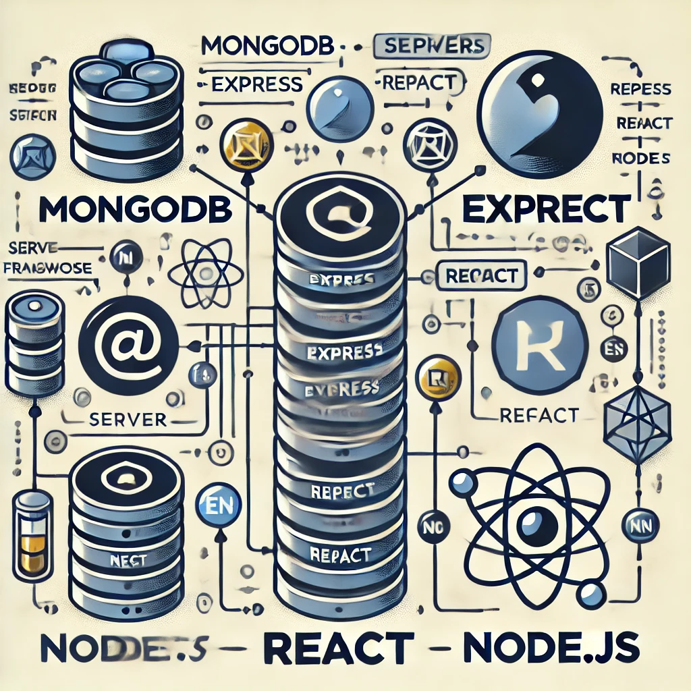

# ecommerce-shop
ecommerce website built with MERN &amp; Redux Toolkit
Un site e-commerce complet développé avec la stack MERN (MongoDB, Express, React, Node.js) et Redux Toolkit pour la gestion d'état globale.
Documentation Technique Docker pour le Projet E-commerce
1. Introduction
Ce document présente la configuration Docker utilisée pour containeriser et orchestrer les services d'une application e-commerce développée en Node.js (backend) et en React ou autre framework JavaScript (frontend). L'objectif est de simplifier le déploiement et le développement en utilisant Docker Compose pour gérer l'ensemble des services.

2. Architecture du Projet
Le projet est structuré de la manière suivante :

bash
Copier
Modifier
.
├── package.json                # Fichiers racine pour le backend et/ou la configuration globale
├── package-lock.json
├── .env                        # Variables d'environnement
├── docker-compose.yml          # Orchestration des services
├── backend/                    # Code source du backend
│   └── Dockerfile              # Dockerfile du backend
└── frontend/                   # Code source du frontend
    └── Dockerfile              # Dockerfile du frontend
Backend : Géré via Node.js, écoute sur le port 5000.

Frontend : Géré via un framework JavaScript (par exemple React), écoute sur le port 3000.

Docker Compose : Ordonne le démarrage des deux services en garantissant la communication entre eux.

3. Fichier docker-compose.yml
Le fichier Docker Compose définit et configure les services nécessaires. Voici le contenu avec une explication ligne par ligne :

yaml
Copier
Modifier
version: "3.8"

services:
  backend:
    build:
      context: .               # Le contexte racine permet d'accéder aux fichiers situés à la racine (package.json, .env, etc.)
      dockerfile: backend/Dockerfile  # Utilise le Dockerfile situé dans le dossier 'backend'
    container_name: ecommerce-backend
    restart: always            # Redémarre toujours le conteneur en cas d'arrêt ou de plantage
    ports:
      - "5000:5000"            # Mappe le port 5000 du conteneur au port 5000 de la machine hôte
    environment:
      - PORT=5000              # Définit la variable d'environnement PORT pour le conteneur backend
    volumes:
      - .:/app                 # Monte le répertoire racine dans /app pour faciliter le développement (mise à jour en temps réel)
    command: ["npm", "start"]  # Commande de démarrage du backend

  frontend:
    build:
      context: ./frontend      # Le contexte est le dossier 'frontend'
      dockerfile: Dockerfile   # Utilise le Dockerfile présent dans le dossier 'frontend'
    container_name: ecommerce-frontend
    restart: always            # Redémarre le conteneur automatiquement
    ports:
      - "3000:3000"            # Mappe le port 3000 du conteneur au port 3000 de la machine hôte
    depends_on:
      - backend               # S'assure que le backend démarre avant le frontend
    volumes:
      - ./frontend:/app        # Monte le dossier 'frontend' dans /app pour faciliter le développement
    command: ["npm", "start"]  # Commande de démarrage du frontend
Points Clés
Build Context : Pour le service backend, le contexte est défini sur la racine afin de permettre l'accès aux fichiers situés dans le dossier parent (comme package.json, .env). Pour le frontend, le contexte est limité au dossier frontend.

Volumes : Le montage des volumes est utile pour le développement. Les modifications dans le code source sont automatiquement reflétées dans les conteneurs.

Ports : Les ports 5000 (backend) et 3000 (frontend) sont exposés pour permettre l'accès via le navigateur ou d'autres clients.

Dépendance : Le service frontend dépend du service backend pour garantir que le backend est opérationnel avant de démarrer le frontend.

4. Dockerfile du Backend
Ce Dockerfile définit l'image Docker pour le backend. Il s'assure que les dépendances sont installées et que les fichiers nécessaires sont copiés dans le conteneur.

dockerfile
Copier
Modifier
FROM node:20-alpine3.16

# Définir le répertoire de travail dans le conteneur
WORKDIR /app

# Copier package.json et package-lock.json depuis le dossier parent
COPY ../package.json ./
COPY ../package-lock.json ./

# Installer les dépendances
RUN npm install

# Copier tous les fichiers du dossier backend dans le conteneur
COPY backend/ ./backend/

# Copier le fichier .env dans le conteneur (assurez-vous que ce fichier est dans votre répertoire racine)
COPY ../.env ./

# Définir la variable d'environnement pour le port
ENV PORT=5000

# Exposer le port
EXPOSE 5000

# Lancer l'application
CMD ["npm", "start"]
Explications :
FROM node:20-alpine3.16 : Utilise une image allégée de Node.js basée sur Alpine Linux.

WORKDIR /app : Définit le répertoire de travail dans le conteneur.

COPY ../package.json ./ : Copie le fichier package.json (et package-lock.json) depuis le répertoire parent dans le conteneur.
(Note : Cette structure suppose que le contexte de build est la racine du projet.)

RUN npm install : Installe les dépendances du backend.

COPY backend/ ./backend/ : Copie le code source du dossier backend dans le conteneur.

COPY ../.env ./ : Copie le fichier .env pour les variables d'environnement.

ENV PORT=5000 et EXPOSE 5000 : Configure et expose le port sur lequel l'application s'exécute.

CMD ["npm", "start"] : Démarre l'application avec la commande npm start.

5. Dockerfile du Frontend
Ce Dockerfile définit l'image Docker pour le frontend. Il est généralement plus simple car il ne nécessite pas la copie de fichiers situés dans un dossier parent.

dockerfile
Copier
Modifier
FROM node:20-alpine3.16

WORKDIR /app

# Copier package.json dans le conteneur
COPY package.json ./

# Installer les dépendances
RUN npm install

# Copier tous les fichiers du projet dans le conteneur
COPY . ./

# Définir la variable d'environnement pour le port
ENV PORT=3000

# Exposer le port dynamique
EXPOSE ${PORT}

# Lancer l'application
CMD [ "npm", "start" ]
Explications :
WORKDIR /app : Définit le répertoire de travail pour le frontend.

COPY package.json ./ : Copie le fichier package.json du dossier frontend.

RUN npm install : Installe les dépendances nécessaires pour le frontend.

COPY . ./ : Copie l'ensemble du code source du frontend dans le conteneur.

ENV PORT=3000 et EXPOSE ${PORT} : Configure et expose le port 3000.

CMD [ "npm", "start" ] : Démarre le serveur de développement ou l'application frontend.

6. Instructions d'Utilisation
Pour construire et exécuter l'ensemble des services, suis ces étapes :

Ouvre un terminal dans le répertoire racine du projet (là où se trouve le fichier docker-compose.yml).

Construis et démarre les conteneurs en utilisant Docker Compose :

bash
Copier
Modifier
docker-compose up --build
Accède à ton application :

Frontend : Ouvre ton navigateur à l'adresse http://localhost:3000

Backend : Pour tester les API, utilise http://localhost:5000

Surveille les logs pour vérifier que tout fonctionne correctement :

bash
Copier
Modifier
docker-compose logs -f
Pour arrêter l'application :

bash
Copier
Modifier
docker-compose down
7. Conclusion
Cette documentation décrit en détail la configuration Docker pour ton projet e-commerce, incluant l'orchestration avec Docker Compose et la containerisation des services backend et frontend. En suivant ces instructions, tu pourras déployer et développer ton application dans un environnement isolé et reproductible.

N'hésite pas à adapter ces fichiers et cette documentation en fonction des évolutions de ton projet ou des besoins spécifiques de ton environnement de développement.


## Table des Matières

1. [Description](#description)
2. [Fonctionnalités](#fonctionnalités)
3. [Technologies Utilisées](#technologies-utilisées)
4. [Installation](#installation)
5. [Scripts](#scripts)
6. [Utilisation](#utilisation)
7. [Seeder Data](#seeder-data)
8. [API](#api)
9. [Contributions](#contributions)
10. [Licence](#licence)

## Description

Ce projet est un site e-commerce complet qui permet aux utilisateurs de :
- Naviguer parmi des produits
- Ajouter des produits au panier
- Passer une commande
- Payer via un système de paiement intégré :(payPal)
- Voir l'historique des commandes

L'administrateur peut également :
- Ajouter, modifier ou supprimer des produits
- Gérer les commandes des clients
- Gérer les utilisateurs

## Fonctionnalités

- [x] Authentification utilisateur (JWT)
- [x] Système de panier d'achat
- [x] Paiement intégré (PayPal)
- [x] Gestion des commandes et des utilisateurs pour l'administrateur
- [x] Gestion du stock des produits
- [x] Système d'évaluation des produits

## Technologies Utilisées

- **Frontend** : React, Redux Toolkit, React Router
- **Backend** : Node.js, Express
- **Base de données** : MongoDB
- **Gestion d'état** : Redux Toolkit
- **Autres** : JWT (JSON Web Token) pour l'authentification, PayPal API pour le paiement

## Installation

### Pré-requis

Assurez-vous d'avoir installé les outils suivants sur votre machine :

- [Node.js](https://nodejs.org/)
- [MongoDB](https://www.mongodb.com/)
- [npm](https://www.npmjs.com/) ou [yarn](https://yarnpkg.com/)

### Étapes d'installation

1. Clonez le dépôt :

```bash
git clone https://github.com/youssefchehata/ecommerce-shop.git 
```

2. Accédez au répertoire du projet :

```bash
cd ecommerce-shop
```

3. Installez les dépendances pour le frontend et le backend :

```bash
npm install && cd frontend npm install

```

4. Créez un fichier `.env` dans le répertoire principal et configurez les variables d'environnement comme suit :

```bash
# MongoDB URI
MONGO_URI=""

# JWT Secret
JWT_SECRET=your_jwt_secret

# PayPal Client ID
PAYPAL_CLIENT_ID=your_paypal_client_id

# Mode (development or production)
NODE_ENV=development

# Port
PORT=5000
```

### Seeder Data (Données de démarrage)

Le projet contient des données initiales pour les produits et les utilisateurs, vous pouvez les importer ou les supprimer avec les commandes suivantes :

- Pour importer les données :
  
  ```bash
  npm run data:import
  ```

- Pour supprimer les données :
  
  ```bash
  npm run data:destroy
  ```

## Scripts

Voici la liste des principaux scripts disponibles dans le projet :

- **Démarrer l'application en mode production** :

  ```bash
  npm start
  ```
  - Lance uniquement le serveur backend.

- **Démarrer le serveur backend avec Nodemon** :

  ```bash
  npm run server
  ```
  - Utilise Nodemon pour redémarrer automatiquement le serveur backend lors de changements dans les fichiers.

- **Démarrer le client React** :

  ```bash
  npm run client
  ```
  - Lance le serveur de développement React (frontend).

- **Démarrer le backend et le frontend en même temps (mode développement)** :

  ```bash
  npm run dev
  ```
  - Utilise `concurrently` pour exécuter le backend et le frontend simultanément.

- **Importer les données de démarrage (produits et utilisateurs)** :

  ```bash
  npm run data:import
  ```

- **Détruire les données de démarrage** :

  ```bash
  npm run data:destroy
  ```

## Utilisation

### Démarrage en mode développement

Pour démarrer l'application en mode développement avec le backend et le frontend exécutés simultanément, exécutez :

```bash
npm run dev
```

Le serveur backend s'exécute sur `http://localhost:5000` et le frontend sur `http://localhost:3000`.

### Démarrage en mode production

En mode production, assurez-vous d'abord de créer une version optimisée du frontend en exécutant :

```bash
cd frontend
npm run build
```

Ensuite, démarrez l'application en production avec :

```bash
npm start
```

## API

Le backend expose plusieurs endpoints pour gérer les produits, les commandes, et l'authentification. Voici un exemple d'endpoint pour récupérer les produits :

```bash
GET /api/products
```

- **Réponse** : Une liste des produits disponibles dans la base de données.


## Contributions


## Licence

Ce projet est sous licence [MIT](./LICENSE).
